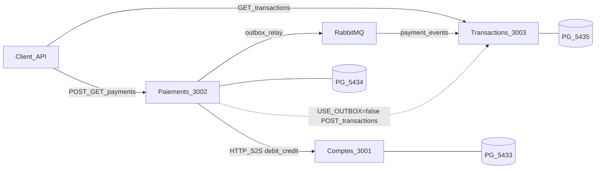

# Paynah Payment System


Mini-système de paiement en **3 microservices NestJS**, **une PostgreSQL par service**, orchestration débit → crédit, journal d’opérations (outbox RabbitMQ ou fallback REST).

---

## Stack

| Couche | Choix |
|---|---|
| Runtime | Node.js + TypeScript |
| Framework | NestJS (monorepo `apps/*` + `libs/shared-kernel`) |
| Package manager | pnpm |
| ORM | TypeORM (`synchronize: false`, migrations) |
| DB | PostgreSQL 16 — 3 instances |
| Broker | RabbitMQ (exchange topic `payments.events`) |
| HTTP client | `@nestjs/axios` |

| Service | Port HTTP | Postgres hôte |
|---|---|---|
| Comptes | `3001` | `5433` |
| Paiements | `3002` | `5434` |
| Transactions | `3003` | `5435` |

RabbitMQ : `5672` / UI `15672` (`paynah` / `paynah`). Variables : [`.env.example`](.env.example). Infra : [`docker-compose.yaml`](docker-compose.yaml).

---

## Architecture



### Communication

Les mutations de solde restent en **REST synchrone**. La journalisation cible un **outbox + RabbitMQ** (at-least-once). Un mode dégradé `USE_OUTBOX=false` appelle `POST /transactions` en synchrone pour garantir le livrable si le broker est indisponible.

---

## Features

### Comptes (`:3001`)
- Users / wallets / solde (`POST /users`, `POST /accounts`, `GET /accounts/:id/balance`)
- Débit / crédit atomiques (`UPDATE … WHERE balance >= amount`) + ledger `operation_id` UNIQUE (replay idempotent)
- Auth S2S : header `x-service-token` sur debit/credit
- Seed `alice` / `bob` + script race `./apps/comptes/test/race-debit.sh`

### Paiements (`:3002`) — hexagonal
- Machine à états : `PENDING` → `DEBITED` → `COMPLETED` / `FAILED` / `COMPENSATED`
- Port `AccountsPort` + `AccountsHttpClient` (timeout 2s, mapping erreurs)
- `POST /payments` + `GET /payments/:id` ; header obligatoire `idempotency-key`
- Compensation : crédit source (`:compensate`) si échec crédit destination
- Outbox transactionnelle (même TX que le statut terminal) + relay RabbitMQ (poll 500 ms, `SKIP LOCKED`)
- Fallback `USE_OUTBOX=false` → journal sync via REST

### Transactions (`:3003`) — CQRS
- Commande `RecordTransaction` (idempotente sur `operationId`) + `POST /transactions`
- Query historique `GET /transactions?accountId=` (keyset `cursor`, fallback `page`)
- Consumer RMQ `payment.succeeded` / `payment.failed` + dédup `inbox` (`event_id` UNIQUE)
- Succès → 2 lignes journal (`:journal:debit` + `:journal:credit`)

### Shared kernel
- `Money` (`amountMinor`), codes d’erreur, headers, contrats `PaymentSucceededEvent` / `PaymentFailedEvent`

---

## Quickstart

```bash
cp .env.example .env
pnpm install
docker compose up -d

pnpm migration:run:comptes
pnpm migration:run:paiements
pnpm migration:run:transactions
pnpm seed:comptes
# note les walletId affichés (Alice / Bob)

pnpm start:comptes       # :3001
pnpm start:paiements     # :3002
pnpm start:transactions  # :3003
```

### Smoke paiement + journal

```bash
WALLET_A=<walletAlice>
WALLET_B=<walletBob>

curl -s -X POST http://localhost:3002/payments \
  -H 'content-type: application/json' \
  -H 'idempotency-key: smoke-1' \
  -d "{\"sourceAccountId\":\"${WALLET_A}\",\"destinationAccountId\":\"${WALLET_B}\",\"amountMinor\":100,\"currency\":\"XOF\"}"
# → status COMPLETED

# rejeu même clé → même payment id
# solde insuffisant → 422 INSUFFICIENT_FUNDS

# historique (après relay / consumer, quelques centaines de ms)
curl -s "http://localhost:3003/transactions?accountId=${WALLET_A}&limit=10"
```

### Mode fallback REST

```bash
USE_OUTBOX=false pnpm start:paiements
# même POST /payments → journal immédiat via POST /transactions (pas d’outbox)
```

### Race ledger Comptes

```bash
./apps/comptes/test/race-debit.sh <WALLET_ID>
# 2× débit 80 sur solde 100 → 1 succès + 1×422, balance=20
```

---

## API (résumé)

| Méthode | Route | Service |
|---|---|---|
| `POST` | `/users` | Comptes |
| `POST` | `/accounts` | Comptes |
| `GET` | `/accounts/:id/balance` | Comptes |
| `POST` | `/accounts/:id/debit` · `/credit` | Comptes (S2S) |
| `POST` | `/payments` | Paiements (`idempotency-key`) |
| `GET` | `/payments/:id` | Paiements |
| `POST` | `/transactions` | Transactions |
| `GET` | `/transactions?accountId=` | Transactions |

---

## Checklist sujet (PDF)

| Exigence | Statut | Notes |
|---|---|---|
| ≥ 3 microservices NestJS | Fait | `apps/comptes`, `apps/paiements`, `apps/transactions` |
| 1 Postgres / service | Fait | Compose `5433` / `5434` / `5435` |
| Comptes : users, wallets, balance | Fait | |
| Comptes : crédit / débit + solde insuffisant | Fait | `422` + `race-debit.sh` |
| Token service S2S | Fait | `x-service-token` |
| Shared types / erreurs / headers | Fait | `libs/shared-kernel` |
| Paiements : modèle + ports HTTP Comptes | Fait | |
| Hexagonal ≥ 1 service | Fait | Paiements (ports / adapters / use case) |
| `POST /payments` + `GET /payments/:id` | Fait | |
| Idempotence initiation (`Idempotency-Key`) | Fait | Table `idempotency_keys` |
| Compensation crédit échoué | Fait | Statut `COMPENSATED` |
| Timeouts client HTTP | Partiel | Timeout 2s + mapper ; retries / CB absents |
| Validation DTO | Fait | Pipe global + DTOs Comptes / Paiements / Transactions |
| Transactions : journal + historique paginé | Fait | Keyset + `page` |
| CQRS ≥ 1 flux | Fait | Command record + query history |
| Outbox / RabbitMQ ou fallback REST | Fait | `USE_OUTBOX=true\|false` |
| Exception filter + erreurs normalisées | Reste | Codes shared-kernel ; filter global absent |
| Swagger ou Postman | Reste | |
| Tests auto (cas critiques) | Reste | Smokes manuels + race script |
| JWT bordure publique | Reste | Optionnel |
| Observabilité (Prometheus / OTel) | Reste | Bonus |

**Légende :** Fait · Partiel · Reste

---

## Structure repo

```
apps/
  comptes/        # ledger + API comptes
  paiements/      # saga, idempotency, outbox + relay
  transactions/   # CQRS journal, inbox consumer
libs/
  shared-kernel/  # Money, ErrorCode, headers, events
docs/
  cover.png
docker-compose.yaml
.env.example
```

---

## Licence

Projet de test technique — usage privé.
