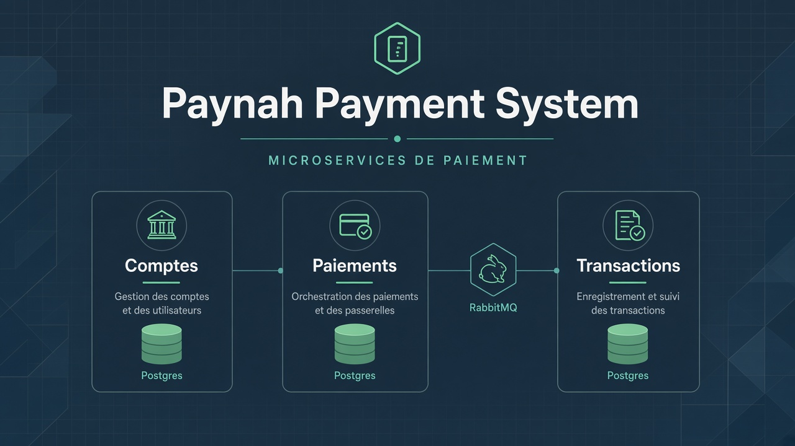
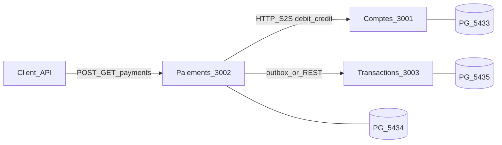

# Paynah Payment System



Mini-système de paiement en **3 microservices NestJS**, **une PostgreSQL par service**, orchestration débit → crédit, journal d’opérations.

---

## Stack

| Couche | Choix |
|---|---|
| Runtime | Node.js + TypeScript |
| Framework | NestJS (monorepo `apps/*` + `libs/shared-kernel`) |
| Package manager | pnpm |
| ORM | TypeORM (`synchronize: false`, migrations) |
| DB | PostgreSQL 16 — 3 instances |
| Broker | RabbitMQ (prévu pour outbox ; fallback REST possible) |
| HTTP client | `@nestjs/axios` |

| Service | Port HTTP | Postgres hôte |
|---|---|---|
| Comptes | `3001` | `5433` |
| Paiements | `3002` | `5434` |
| Transactions | `3003` | `5435` |

RabbitMQ : `5672` / UI `15672`. Variables : [`.env.example`](.env.example). Infra : [`docker-compose.yaml`](docker-compose.yaml).

---

## Architecture



---

## Features

- **Comptes** — users, wallets, solde ; débit / crédit atomiques (`UPDATE … WHERE balance >= amount`) ; ledger avec `operation_id` unique (replay idempotent).
- **Auth S2S** — `x-service-token` sur les endpoints ledger internes.
- **Paiements (hexa)** — domaine machine à états (`PENDING` → `DEBITED` → `COMPLETED` / `FAILED` / `COMPENSATED`) ; port `AccountsPort` + adapter HTTP vers Comptes (timeout 2s, mapping erreurs).
- **Shared kernel** — `Money` (`amountMinor`), codes d’erreur, headers, contrats d’événements.
- **Infra locale** — 3 Postgres + RabbitMQ via Compose ; seed Comptes (`alice` / `bob`).

---

## Quickstart

```bash
cp .env.example .env
pnpm install
docker compose up -d

pnpm migration:run:comptes
pnpm migration:run:paiements
pnpm seed:comptes

pnpm start:comptes      # :3001
pnpm start:paiements    # :3002
pnpm start:transactions # :3003 (scaffold)
```

Smoke ledger (service Comptes up) :

```bash
# race 2× débit 80 sur solde 100 → 1 succès + 1×422, balance=20
./apps/comptes/test/race-debit.sh <WALLET_ID>
```

---

## Checklist sujet (PDF)

| Exigence | Statut | Notes |
|---|---|---|
| ≥ 3 microservices NestJS | Fait | `apps/comptes`, `apps/paiements`, `apps/transactions` |
| 1 Postgres / service | Fait | Compose ports `5433` / `5434` / `5435` |
| Comptes : users, wallets, balance | Fait | `POST /users`, `POST /accounts`, `GET /accounts/:id/balance` |
| Comptes : crédit / débit + solde insuffisant | Fait | `422 INSUFFICIENT_FUNDS` ; script `race-debit.sh` |
| Token service S2S | Fait | Guard `x-service-token` sur debit/credit |
| Shared types / erreurs / headers | Fait | `libs/shared-kernel` |
| Paiements : modèle + ports HTTP Comptes | Fait | Entity `payments` + `AccountsHttpClient` |
| Hexagonal ≥ 1 service | Partiel | Ports/adapters OK ; use case saga + API payments manquants |
| Timeouts client HTTP | Partiel | Timeout 2s + mapper ; retries / circuit breaker absents |
| Validation DTO | Partiel | Global pipe + DTOs Comptes ; Paiements/Transactions incomplets |
| `POST /payments` + `GET /payments/:id` | Reste | Orchestration saga à brancher |
| Idempotence initiation (`Idempotency-Key`) | Reste | Header partagé seulement |
| Compensation crédit échoué | Reste | États domaine prêts |
| Transactions : journal + historique paginé | Reste | Scaffold Hello World |
| CQRS ≥ 1 flux | Reste | Prévu côté Transactions |
| Outbox / RabbitMQ ou fallback REST sync | Reste | Broker Compose up ; pas de code relay |
| Exception filter + erreurs normalisées | Reste | Codes dans shared-kernel |
| Swagger ou Postman | Reste | — |
| Tests auto (cas critiques) | Reste | Race manuelle OK |
| JWT bordure publique | Reste | Optionnel selon sujet |
| Observabilité (Prometheus / OTel) | Reste | Bonus |

**Légende :** Fait · Partiel · Reste

---

## Structure repo

```
apps/
  comptes/       # ledger + API comptes
  paiements/     # orchestration (en cours)
  transactions/  # journal (à faire)
libs/
  shared-kernel/ # contrats partagés
docs/
  cover.png
docker-compose.yaml
.env.example
```

---

## Licence

Projet de test technique — usage privé.
